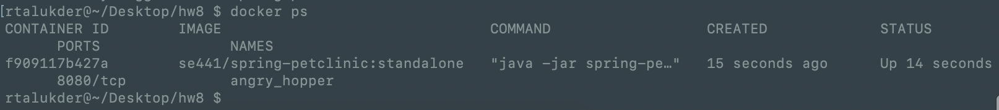
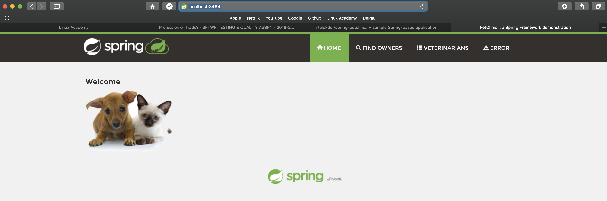
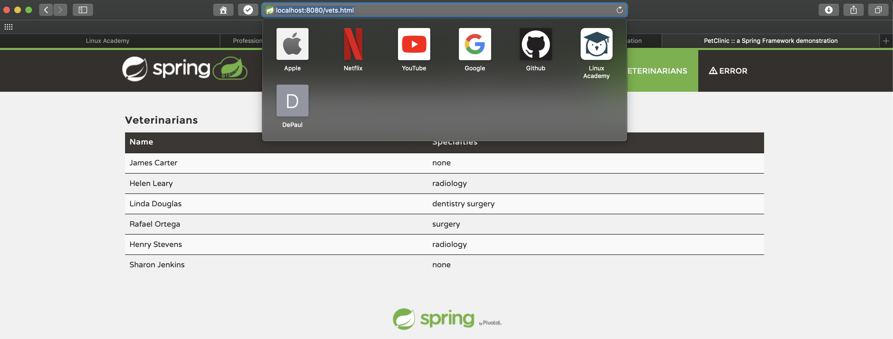

# Homework 8 - Submission 
DePaul ID: 1361086

# Docker [15 pts]

- [5 pts] Your [Dockerfile](Dockerfile). Please provide a link to this file rather than a screen capture. 

- [5 pts] Your running docker instance as shown by a ps command.

- [5 pts] Your browser accessing the main page of the website from your local container.

# Docker Compose - MySQL Only [15 pts]

- [5 pts] The output from the [docker-compose up](hw8_outputs/mysql_docker-compose_up.txt) command.

- [5 pts] Your browser accessing the “Veterinarians” page of the website from your local con-
tainer when you run the application from the host system.

- [5 pts] A section of the [stack trace](hw8_outputs/mysql_docker_run_exception.txt) generated when you attempt to run the application container that has been updated to use MySQL.

# Docker Compose - App Server and MySQL [20 pts]

- [5 pts] Your updated [docker-compose.yml](docker-compose.yml) file containing the application server, built from your local Dockerfile, and the existing MySQL configuration. Please provide a link to this file rather than a screen capture.

- [5 pts] Your updated [application-mysql.properties](src/main/resources/application-mysql.properties) file containing the URL change for the database server. Please provide a link to this file rather than a screen capture.

- [5 pts] The output from the [docker-compose up](hw8_outputs/docker-compose_up_both.txt) command.

- [5 pts] Your browser accessing the “Veterinarians” page of the website from your local container.
[Dockerized Application Up](both_application_up.PNG)